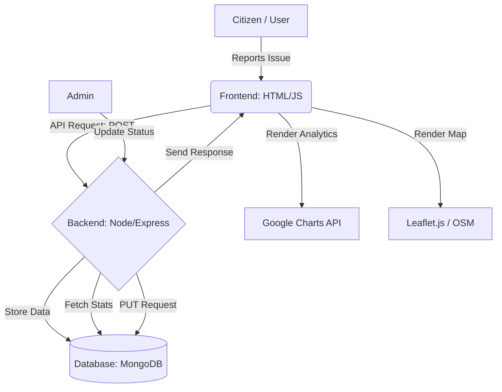

# CivicConnect-Smart-Complaint-Reporting-System

CivicConnect is a high-performance, citizen-driven platform designed to bridge the gap between residents and local authorities. It empowers users to report real-world issues such as road damage, garbage, and streetlighting with precise GPS data, real-time tracking, and data-driven analytics and stronger civic responsibility at zero cost.

## 📺 Project Walkthrough
### 🚀 [Live Demo: Experience CivicConnect](https://civic-connect-smart-complaint-repor.vercel.app/)
### 🚀 [Demo Video Link: ](https://youtu.be/xBH3V7bbu4A)
Click the badge above to watch the full project explanation and technical demonstration

## 🧩 The Problem

In many cities, civic issues often go unreported or unresolved due to:
- Opacity: Citizens don't know the status of their reports.
- Inaccuracy: Manual location descriptions lead to confusion for repair crews.
- Redundancy: Multiple people reporting the same pothole creates data noise.
- Friction: Complicated login processes prevent quick reporting.
- Citizens rarely receive updates once a complaint is raised, leading to frustration and mistrust in governance systems.

## 💡 Our Solution

CivicConnect provides a zero-cost, web-based solution where:
- Interactive Map Reporting: Users drop a pin to capture exact coordinates (Latitude/Longitude).
- Public Dashboard: A transparent view of all civic issues and their current resolution status.
- Intelligent Grouping: A "Report Same Issue" feature that increases priority without cluttering the database.
- Visual Analytics: Dynamic charts to help authorities identify high-frequency problem zones.
- This system ensures end-to-end visibility from complaint submission to resolution.

## 👉 View all screenshots in the **/screenshots** folder.

## Process Flow & System Architecture Diagram

## 🚀 Opportunities Addressed
 
  

## How CivicConnect Is Different & Better

## 🧠 Brief About the Solution

- CivicConnect is built using a modern web architecture with separation of concerns:
  - Frontend handles UI and user interactions
  - Backend manages complaint logic and APIs
  - Database stores complaints securely
- The system ensures that:
  - Every complaint is uniquely identifiable
  - Status changes are reflected instantly
  - Duplicate complaints strengthen issue priority
  
## Technologies Used
- 🌐 Frontend
   - HTML5
   - CSS3 (Modern UI Design)
   - JavaScript (ES6+)
- ⚙ Backend
   - Node.js
   - Express.js
- 🗄 Database
   - MongoDB
   - Mongoose ODM
- Deployment
   - Netlify (Frontend)
- Analytics
   - Google Charts API

## 📂 System Architecture
### **High-Level Data Flow**
CivicConnect follows a **decoupled MERN architecture**, ensuring a clear separation between user interaction, business logic, and data persistence.

## How to run locally?
1. Clone the repo:
   
git clone https://github.com/omsalokhe/CivicConnect-Smart-Complaint-Reporting-System

2. Install dependencies
   
npm install

3. Start backend
   
node server.js

4. Open frontend
   
Open index.html using Live Server

## 🛡️ License

 GNU GENERAL PUBLIC LICENSE Version 3, 29 June 2007
 Copyright (C) 2007 Free Software Foundation, Inc. <https://fsf.org/>
 Everyone is permitted to copy and distribute verbatim copies
 of this license document, but changing it is not allowed.

## Developed with ❤️ for Smarter Cities.
- linkedin : www.linkedin.com/in/om-salokhe-78abb4339
- Demo Video Link: https://youtu.be/xBH3V7bbu4A
- MVP Link : CivicConnect is deployed on Netlify for high-performance frontend hosting, ensuring instant access across devices. It connects to a live backend API to deliver a smooth, real-time civic issue reporting experience.
- https://civicconnectscomplaintsystem.netlify.app/

